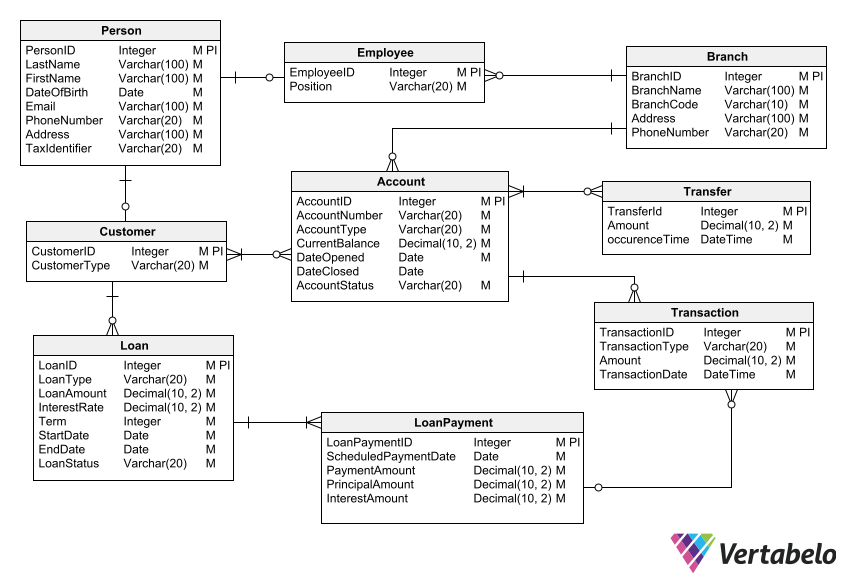

# Design Document

By Shubham Raut

Video overview: https://youtu.be/VJ94TwHTV80

## Scope

In this section you should answer the following questions:

The purpose of this database is to manage and store information related to a bank. It aims to provide a structured representation of various entities and their relationships within the banking system.

In this section you should answer the following questions:

The database includes the following entities:

People: Represents individuals who interact with the bank, including customers and employees.
Branches: Contains information about the different branches or offices of the bank.
Employees: Stores data about individuals who are bank employees.
Customers: Stores information about individuals who are bank customers.
Accounts: Represents the different accounts that customers or groups of customers can have in the bank.
AccountOwnerships: Stores the relationship between accounts and their owners.
Loans: Stores information about the loans granted by the bank to customers.
LoanPayments: Represents the scheduled payments associated with loans.
Transactions: Stores information about the various transactions performed in the bank.
Transfers: Represents transfers of funds between bank accounts.

Entities that are outside the scope of this database include specific financial products (such as investment products), detailed transaction history, audit logs, and security-related information.

## Functional Requirements

Users should be able to perform the following actions with the database:

Add, retrieve, update, and delete information about people, including customers and employees.
Manage branch information, such as adding new branches and updating branch details.
Track and manage employee data, including their positions and branch assignments.
Manage customer information, including their customer type (regular or premium).
Create and manage different types of accounts for customers.
Track account ownership and associations between accounts and customers.
Manage loan information, including loan types, amounts, interest rates, and terms.
Track loan payments and their associated details.
Record and manage various types of transactions, such as deposits and withdrawals.
Perform fund transfers between bank accounts.

## Representation

### Entities
The entities represented in the database are:

People: Represented by the People table, with attributes like id, firstName, lastName, DateOfBirth, PhoneNumber, Email, and Address.
Branches: Represented by the Branches table, with attributes like id, branchName, branchCode, Address, and PhoneNumber.
Employees: Represented by the Employees table, with attributes like id, personId, branchId, and position.
Customers: Represented by the Customers table, with attributes like id, personId, and customerType.
Accounts: Represented by the Accounts table, with attributes like id, branchId, accountType, accountNumber, currentBalance, createdAt, closedAt, and accountStatus.
AccountOwnerships: Represented by the AccountOwnerships table, with attributes like id, accountId, and ownerId.
Loans: Represented by the Loans table, with attributes like id, customerId, loanType, loanAmount, interestrate, term, startDate, endDate, and status.
LoanPayments: Represented by the LoanPayments table, with attributes like id, loanId, scheduledPaymentDate, paymentAmount, principalAmount, interestAmount, paidAmount, and PaidDate.
Transactions: Represented by the Transactions table, with attributes like id, accountId, transactionType, amount, and transactionDate.
Transfers: Represented by the Transfers table, with attributes like id, originAccountId, destinationAccountId, amount, and occurenceTime.

### Relationships

The relationships between the entities in the database are as follows:

The Employees table has foreign key references to the People table (via personId) and the Branches table (via branchId).
The Customers table has a foreign key reference to the People table (via personId).
The Accounts table has a foreign key reference to the Branches table (via branchId).
The AccountOwnerships table has foreign key references to the Accounts table (via accountId) and the Customers table (via ownerId).
The Loans table has a foreign key reference to the Customers table (via customerId).
The LoanPayments table has a foreign key reference to the Loans table (via loanId).
The Transactions table has a foreign keyreference to the Accounts table (via accountId).
The Transfers table has foreign key references to the Accounts table (via originAccountId and destinationAccountId).

## Entity Realtionship Attribute Diagram

## Optimizations

To optimize the performance of the database, the following optimizations can be considered:

Indexes: Creating indexes on frequently queried columns such as accountNumber, customerId, and transactionDate can improve search and retrieval speeds.
Views: Creating views for commonly used queries can simplify complex joins and calculations, providing a more efficient way to access frequently needed information.

## Limitations

The limitations of this database design include:

Limited representation of financial products: The database does not include detailed information about specific financial products, such as investment products, stocks, or bonds.
Simplified transaction history: The database may not capture a comprehensive history of all individual transactions, and may only focus on high-level transaction details.
Lack of advanced security features: The database design does not address advanced security features such as access control lists, user roles, or encryption. These aspects would need to be considered separately for a production-grade system.
Limited analytics capabilities: The design does not include extensive analytical features, such as advanced reporting or data mining capabilities. Additional components would be required to support such functionalities.
Scalability considerations: The design does not explicitly address scalability issues, such as handling a large number of concurrent transactions or horizontal scaling of the database. These aspects would need to be considered during the implementation and deployment phases.
